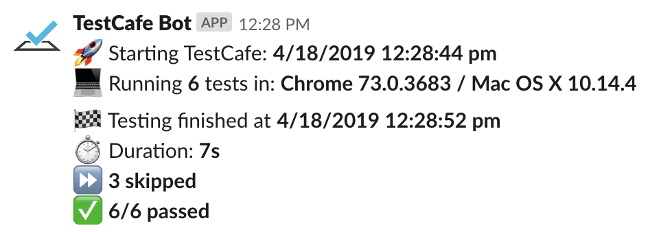
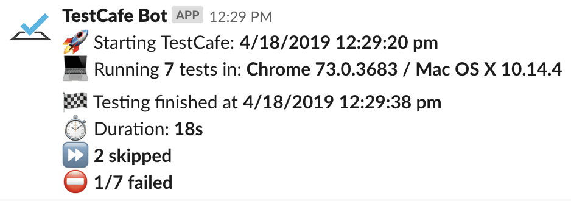

# DEPRECATED
I don't maintain this repo (anymore). Just fork and alter it

# TestCafe Reporter Slack 
### testcafe-reporter-slack

This is a reporter for [TestCafe](http://devexpress.github.io/testcafe). It sends the output of the test to [Slack](https://slack.com/).

## Purpose :dart:
Once configured the reporter sends test results to Slack channel, e.g.





## Installation :construction:

Install this reporter as your test project dependency:

```bash
yarn add testcafe-reporter-slack
```

## Setup instructions :wrench:
In order to use this TestCafe reporter plugin, it is necessary to add it as your reporter to your TestCafe.
 
### Using `.testcaferc.json` config file

Add a reporter name (`slack`) to your `reporter` object:

```json
{
  "browsers": [ "chrome" ],
  "src": "scenarios",
  "reporter": [
    {
      "name": "slack"
    }
  ]
}
```

### Using TestCafe API

Pass the reporter name (`slack`) to the `reporter()` method:

```js
testCafe
    .createRunner()
    .src('path/to/test/file.js')
    .browsers('chrome')
    .reporter('slack') // <-
    .run();
```

### Necessary configuration

After that, you should define **.env** file with variables in your test project, hence the folder from where your call TestCafe (root directory).

```dotenv
# .env
TESTCAFE_SLACK_WEBHOOK=https://hooks.slack.com/services/*****
```

This is **required minimum to has it working**.

## Options :gear:

Slack reporter have few options which could be configured from both, `.testcaferc.json` or `.env` file as global variables.
**It will first retrieve the values from the TestCafe config file `.testcaferc.json`**, after that from `.env` file.

* :warning: - **required**
* :balloon: - optional
* :link: - deprecated

#### Slack Webhook URL :warning:

**This option is required!** Your Slack channel webhook URL generated from Slack API to allow reporter post there.
It's **not recommended** to pass your `webhookUrl` into the config file, in this case, due to sensitive data, it's **better to pass it via global variable** in `.env` file.
* via `.testcaferc.json`

```json
{
  "name": "slack",
  "options": {
    "webhookUrl": "https://hooks.slack.com/services/*****"
  }
}
```

* via `.env` file

```dotenv
# .env
TESTCAFE_SLACK_WEBHOOK=https://hooks.slack.com/services/*****
```

#### Channel :balloon: :link:

Your Slack channel name where you want to post reports.

* via `.testcaferc.json`

```json
{
  "name": "slack",
  "options": {
    "channel": "#testcafe"
  }
}
```

* via `.env` file

```dotenv
# .env
TESTCAFE_SLACK_CHANNEL="#testcafe"
```

#### Username :balloon: :link:

Your Slack app username.

* via `.testcaferc.json`

```json
{
  "name": "slack",
  "options": {
    "username": "testcafebot"
  }
}
```

* via `.env` file

```dotenv
# .env
TESTCAFE_SLACK_USERNAME=testcafebot
```

#### Logging level

Choose your report logging level, if you want to see each test with error stack trace, choose `TEST` (default). The second one is short & condensed which show the only number of tests which passed, failed and was skipped - `SUMMARY`.

* via `.testcaferc.json`

```json
{
  "name": "slack",
  "options": {
    "loggingLevel": "SUMMARY"
  }
}
```

* via `.env` file

```dotenv
# .env
TESTCAFE_SLACK_LOGGING_LEVEL=SUMMARY
```

#### Quiet mode

Choose if you want to have messages in the terminal about sending specific messages to Slack, it's turned off by default.

* via `.testcaferc.json`

```json
{
  "name": "slack",
  "options": {
    "quietMode": true
  }
}
```

* via `.env` file

```dotenv
# .env
TESTCAFE_SLACK_QUIET_MODE=true
```

## Further Documentation :books:
[TestCafe Reporter Plugins](https://devexpress.github.io/testcafe/documentation/extending-testcafe/reporter-plugin/)
